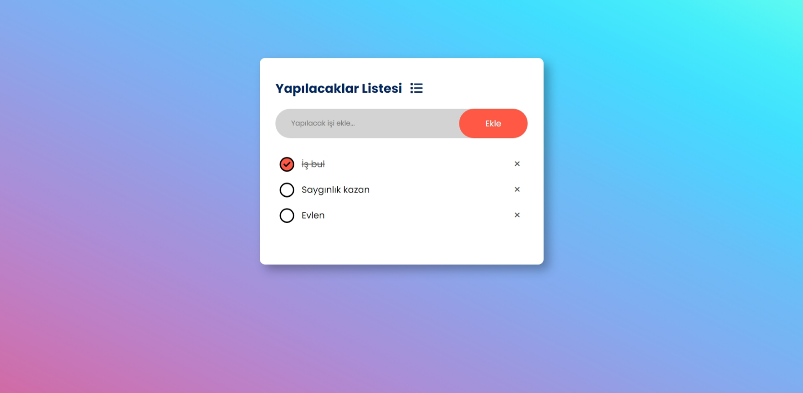

# Todo App

Kullanıcıların yapılacaklar listesi oluşturmasına olanak tanıyan basit bir uygulama.

## Açıklama

Bu proje, kullanıcıların yapılacaklar listesi oluşturmasını, düzenlemesini ve yönetmesini kolaylaştırmak amacıyla geliştirilmiştir. Saf JavaScript, CSS ve HTML kullanılarak oluşturulmuştur. Bilgiler localStorage kullanılarak depolanmıştır.

## Kurulum

Projeyi yerel bilgisayarınıza klonlayarak çalıştırabilirsiniz.
`git clone https://github.com/Ord-Prof-Dr-Soraka/todo-app.git`
